※英語の箇所は未翻訳箇所です。

## page1 表紙
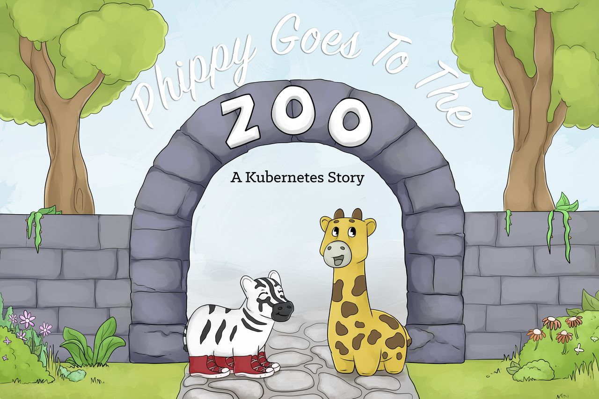

## page2 CNCF Logo

## page3

“フィッピーおばさん、ぼく退屈だよ” ジーはソファに深く倒れかかりました。

“今日は何をするつもりなの？”

“動物を見に行こうか？” フィッピーは笑顔で答えました。

“動物園に行こう！”

"うん！" ジーは大声で答え、靴を探しに走りました。

## page4
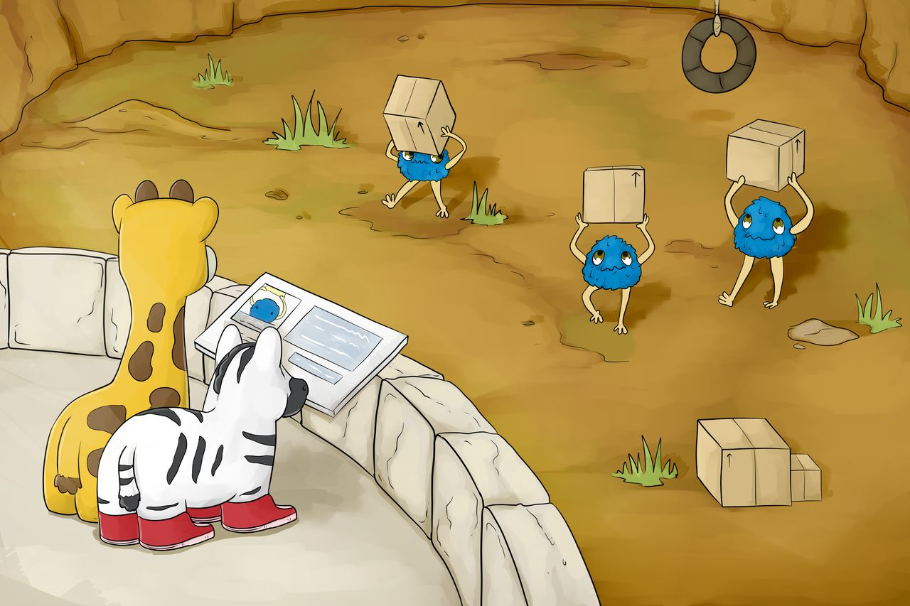

最初に彼らが出会った動物は、リスほどの大きさでした。

毛むくじゃらで青い小さな動物たちは、絶え間なく前後に走るようにして小さな箱を運んでいます。

"あれはポッドだよ！一日中一晩中、彼らは小さなコンテナを持って縦横無尽に走ってるの。"　とフィッピーは言いました。
"フィッピーおばさん、みんなそうしてるの？"

“うん、ジー。全てのポッドが一生そうしてるのよ。彼らはずっと走ってるの。”

## page5
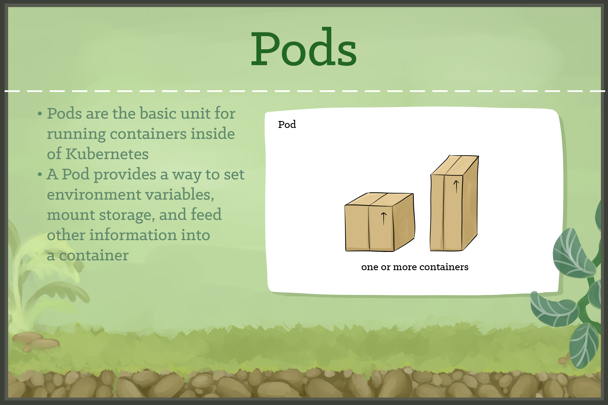

Kubernetesでは、ポッドは自身のコンテナが起動していることに責任を持ちます。

全てのポッドは1つ以上のコンテナをもち、そのコンテナの実行を制御します。

コンテナが停止すると、Podも停止します。

## page6
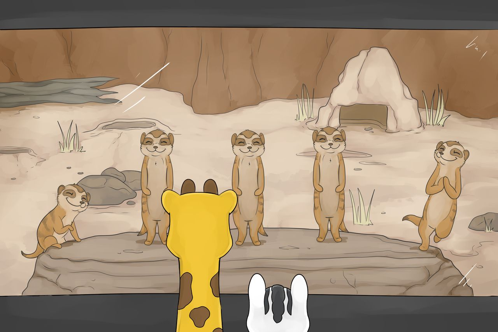

フィッピーとジーが歩いていると、彼らは大きなガラスの檻を見つけました。

窓に押し付けられたのは、一列に並んだミーアキャットの幸せそうな顔でした。

“彼らはレプリカセットよ” フィッピーは言いました。

ジーがみていると、右の彼がニコッと笑って岩棚から離れていきました。

みんな揃って、残った彼らはスペースを埋めるためにぴょんと飛び、同じ種類のミーアキャットが左側に駆け上がりました。

"小さなレプリカが落ちるたびに、もう一人が登ってくるの" とフィッピーは説明しました。

## page7
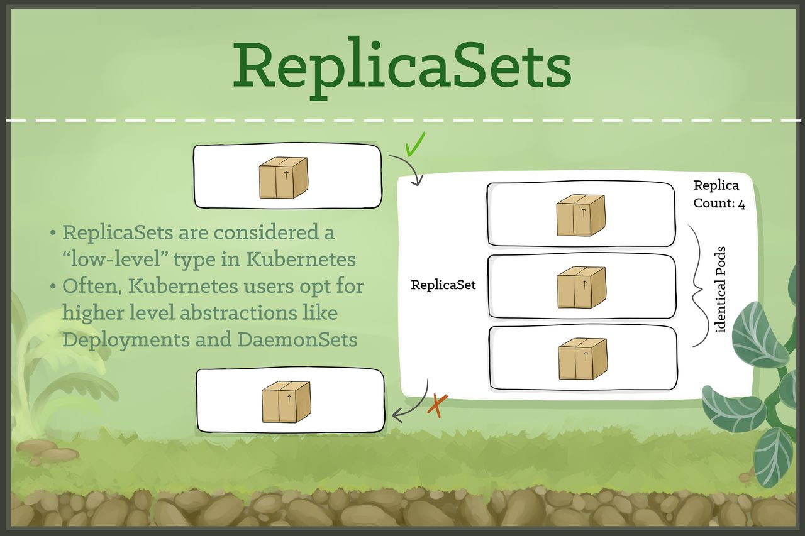

レプリカセットは、同様の設定が行われたポッドが要求されたレプリカ数で起動していることを保証します。

もしポッドが停止した場合、レプリカセットは新しいポッドを交換用としてオンラインにします。

## page8
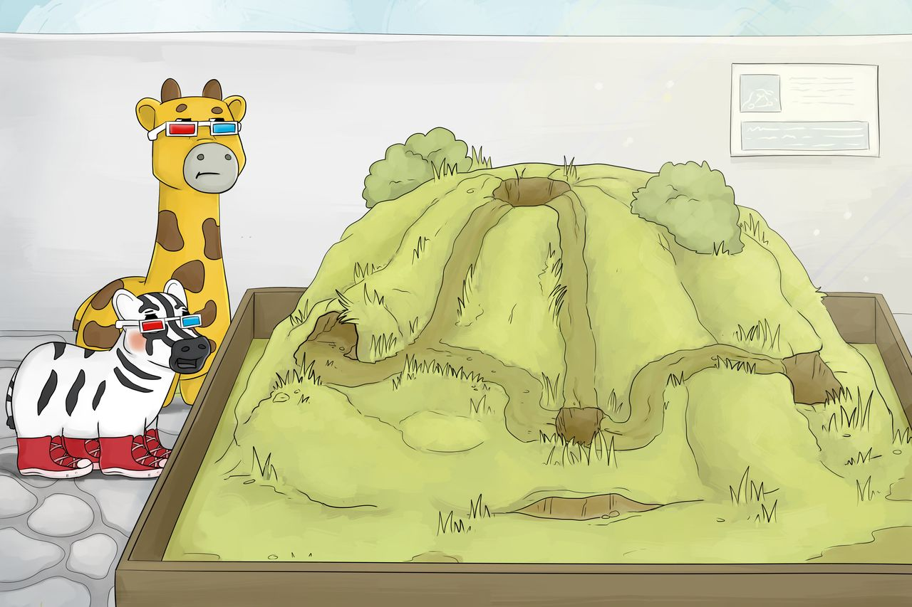

さらに歩き進んでいくと、ジーは巣穴のかたまりをみつけて指さしました。

そこに住んでいたという証拠はいくつもあったけど、フィッピーもジーも動きを確認できませんでした。

“秘密はここにあるわよ” フィッピーは言いました。“でも、暗号を解読するメガネがないとみることができないの”

ジーはフィッピーが持っていた2つのメガネをつけて、それらをスライドさせて顔を赤くしました！

“あぁ分かった！ぼくは準備オッケーだよ。フィッピーおばさん”

ジーはメガネを手渡して、去っていきました。

## page9
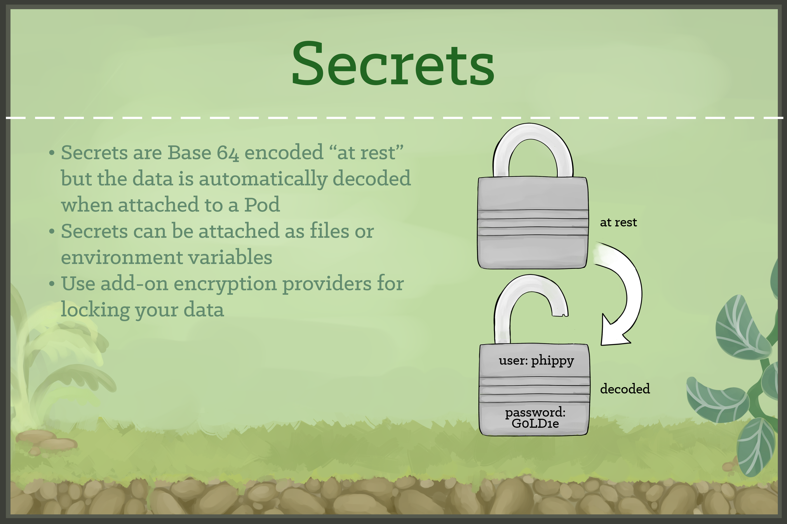

Secretsは、トークン、証明書、パスワードなどの非公開情報を格納するために使用されます。

Secretsは秘匿性の高い設定情報をPodに対して実行時にアタッチできます。これらの設定データはクラスタ内で安全に保存できます。

## page10
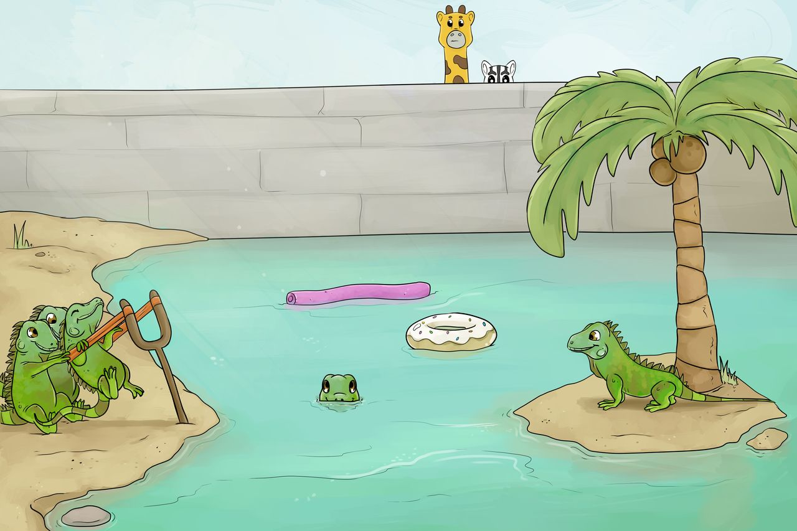

A group of iguanas gathered near a large slingshot along the shore of a pond. 

An island stood in the center of the water.

An iguana threw herself into the slingshot and the other iguanas launched the little beast toward the island.    

“The Deployments release a group onto the island. Right now, they’re trying to get three out there.” said Phippy.

At that moment another iguana rocketed into the air but missed the island with a colossal splash in the pond.  

Phippy said, “If they miss, they just keep trying until they get as many as they need.”

## page11

A Deployment is a higher-order abstraction that controls deploying and maintaining a set of Pods. 

Behind the scenes, it uses a ReplicaSet to keep the Pods running, but it offers sophisticated logic for deploying, updating, and scaling a set of Pods within a cluster.

## page12
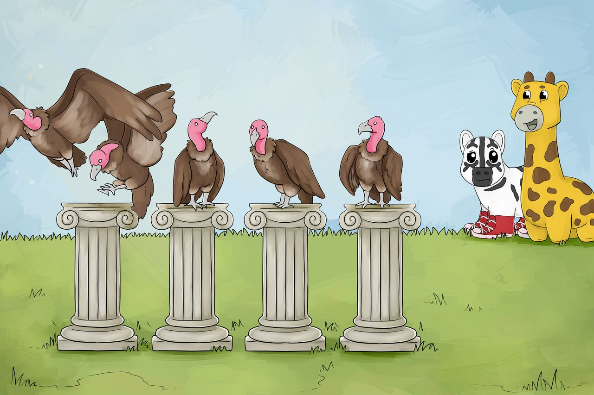

Several stone pillars arose from a grassy knoll and at the top of each sat a vulture. 

As Zee and Phippy watched, one vulture spread its wings and flapped off into the distance. 

No sooner had one left than another took its place. Zee asked, “What are they doing?” 

“Those are DaemonSets,” said Phippy, “They make sure to occupy every pillar, rain or shine, day or night.” 

“I bet that if we added a new pillar, a new bird would land on it faster than you could say ‘cube cuddle,’” chuckled Phippy. 

## page13

DaemonSets provide a way to ensure that a copy of a Pod is running on every node in the cluster. 

As a cluster grows and shrinks, the DaemonSet spreads these specially labeled Pods across all of the nodes.

## page14

As they walked on, they saw an aquarium with an enormous reef. 

Edge-to-edge, it appeared that the rock would keep anything from passing from one side to the other. 

Zee watched as hundreds of tiny fish made a dash for the center of the face of the rock. 

At full speed, the fish swam into a hole bored into the rock face and momentarily vanished from sight.  

Zee let out a gasp. 

Multicolored flashes erupted from the opposite side of the coral. 

Instead of coming out of a single hole, the fish seemed to materialize from tiny fissures all over the far side of the rock.  

“Ingresses are beautiful,” said a dreamy eyed Phippy.  

Enchanted, Zee muttered, “Uh-huh.”

## page15
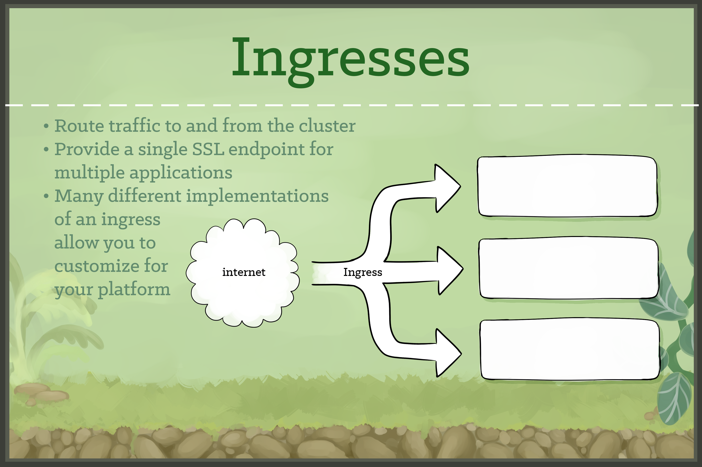

Ingresses provide a way to declare that traffic ought to be channeled from the outside of the cluster into destination points within the cluster. 

One single external Ingress point can accept traffic destined to many different internal services.

## page16
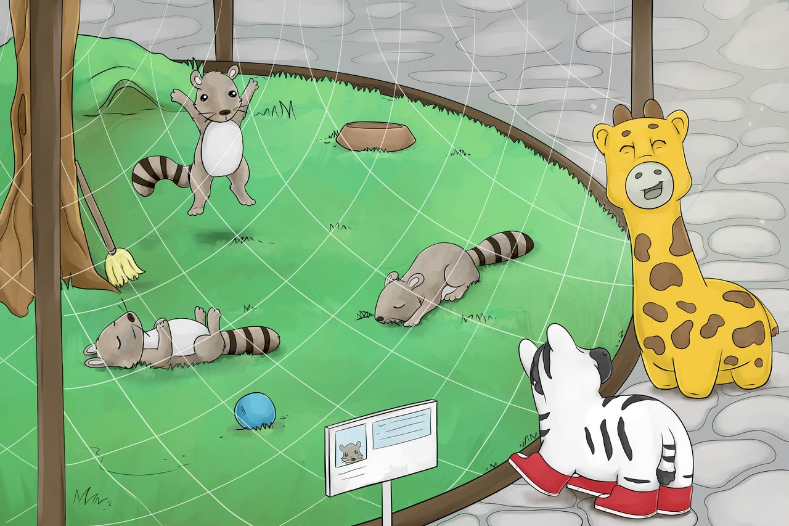

Zee pointed to the raccoons sprawled motionless in the next enclosure. 

“What’s wrong with them?” 

Suddenly, one sprung to its feet, did jumping jacks, then settled back down for another nap. 

“Those are CronJobs,” said Phippy. 

“Mostly, they just sleep. But periodically, they spring into action to do a specific job.” 

As she spoke, another bolted upright, grabbed a broom, swept the entire enclosure, and then dropped off to sleep again. “Aunt Phippy, can I bring that one home to clean my room?” Phippy laughed as they walked on.

## page17
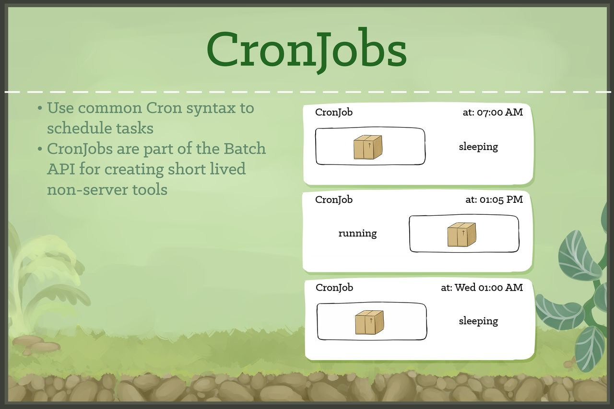

CronJobs（クロンジョブ） は、Podの実行スケジューリングのためのメソッドを提供します。

CronJobsは、バックアップ、レポート、自動化されたテストのような定期的なタスクの実行のために優れています。

## page18
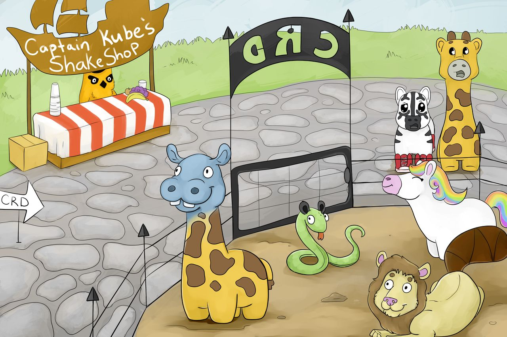

Zee halted abruptly. In the distance, a black-railed fence arose. 

The arches above the pen were marked C-R-D. Between the bars, Zee could make out some peculiar critters.

A giraffe with a hippopotamus head. A snake with raccoon ears. A lion with a beaver’s tail.

A unicorn with no horn. Zee wasn’t sure she liked the looks of that place. 

“Oh,” said Phippy, a look of concern on her face, “Uh… look! It’s lunch time! We’d better head home.” 

With a look of mild relief, Zee complied. 

“Can we stop at Captain Kube’s Shake Shop on the way out?”

## page19
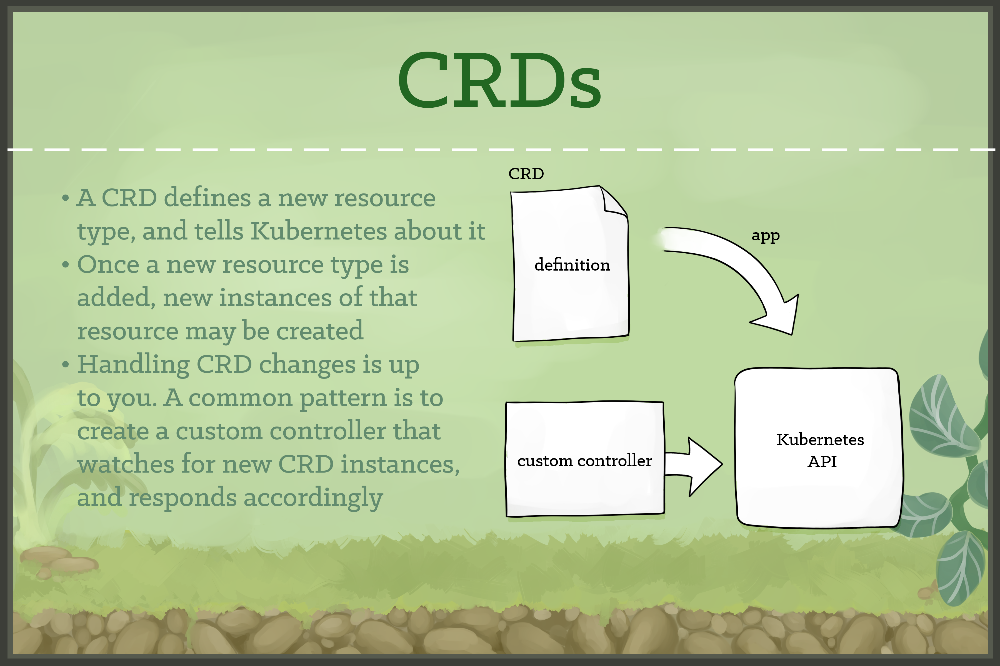

CustomResourceDefinitions, or CRDs, provide an extension mechanism that cluster operators and developers can use to create their own resource types.

## page20
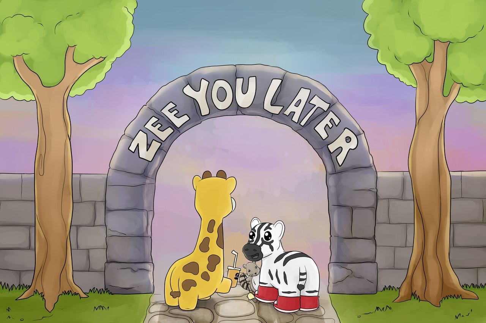

