※英語の箇所は未翻訳箇所です。

## page1 Blank

## page2 Blank

## page3
---

自分の子供たちにソフトウェアエンジニアを説明しようとしている、全ての親たちに捧げます。

## page4 CNCF Logo

## page5 Title
---

## page6
---
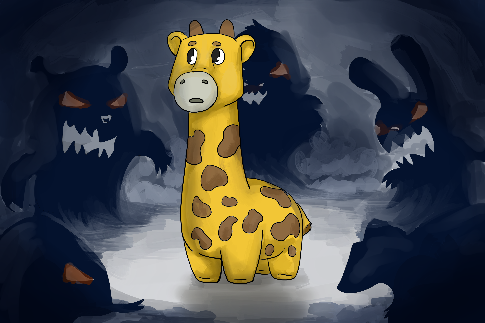
むかしむかし、あるところに、フィッピーというアプリケーションがいました。

彼女はPHPで書かれたシンプルなアプリケーションで、1ページしかありませんでした。

フィッピーはホスティングプロバイダに住んでいて、全く知らない上に特に関わりもないような、怖い怖いほかのアプリたちと自分の環境を共有していました。フィッピーは、自分だけの環境がほしいと思っていました。

ただ、彼女自身と、彼女が家と呼べるような1つのウェブサーバーさえあればよかったのです。

## page7
---
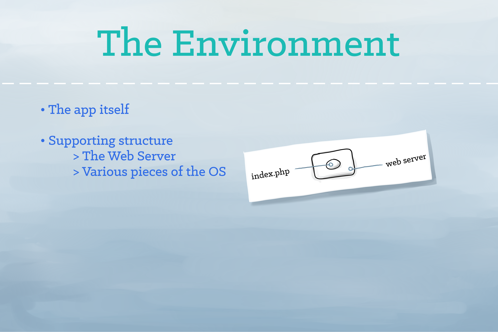
アプリケーションは、動作するために依存する環境を持ちます。

PHPアプリケーションにおいては、その環境にはWebサーバーと、読み取り可能なファイルシステムと、PHPエンジン自体が含まれていることがあるでしょう。

## page8
---

ある日、優しいクジラがやってきました。

彼は、フィッピーがもしかしたらコンテナの中に住んだら幸せになれるんじゃないかと提案し、フィッピーは言われた通りに引っ越しました。

コンテナは快適です、でも…少しだけ素敵なリビングがあって、それが海の真ん中にぽつんと浮かんでいるような感じでした。

## page9
---

コンテナはアプリとその動作環境が一緒に動作可能な独立したコンテキストを提供します。

でも、独立したコンテナは、管理される必要があったり、外部の世界に接続される必要があったりします。

ファイルシステムの共有、ネットワーク、スケジューリング、負荷分散、そして分散配置はすべてチャレンジなのです。

## page10
---
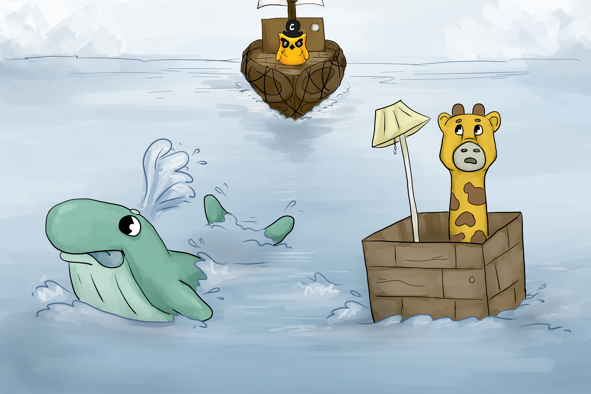
優しいクジラは肩をすくめました。

「ごめんね、、、」と彼は言い、海の下に姿を消そうとしたところ、、、

悲しそうなフィッピーの前に、地平線に巨大な船が現れました。

この巨大な船は数十本のいかだでまとめられたものでしたが、まるで1台の巨大な船に見えました。

「こんにちは、そこのちいさなアプリさん！私の名前はキャプテン・クーベだよ」と船長は言いました。

## page11
---
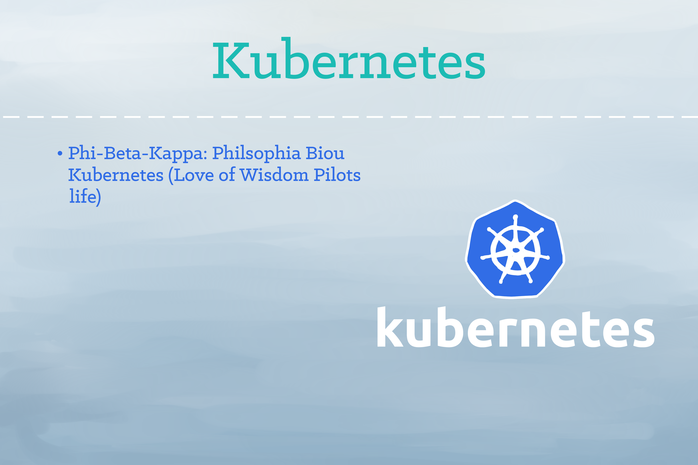
「Kubernetes」は、ギリシャ語で「船長」という意味のことばです。

「Cybernetic」と「Gubernatorial」という言葉は、「Kubernetes」から生まれたものです。

Googleが率いるKubernetesプロジェクトでは、何千ものコンテナを稼動させるため、堅牢なプラットフォームを構築することに重点を置いています。

## page12
---
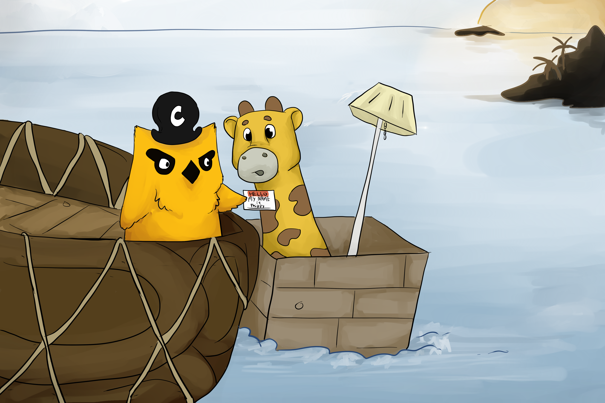
「わたしの名前はフィッピーよ」と彼女は言いました。

「はじめまして！」キャプテン・クーベは名札をわたしました。

## page13
---
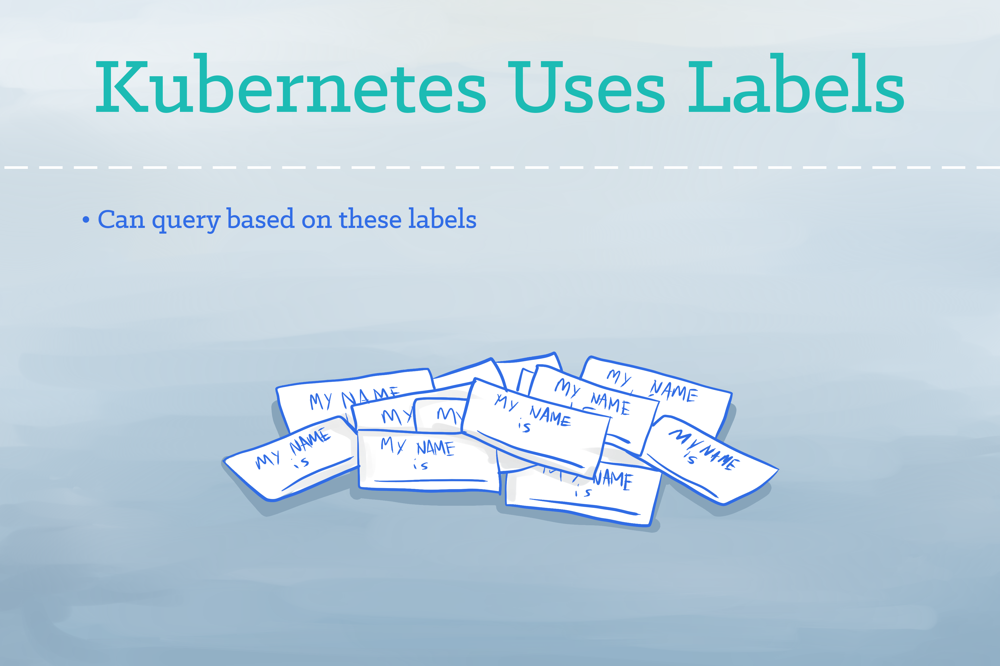
Kubernetesではラベルを「名札」としてリソースを識別します。

このラベルは自由につけることができます。

あなたはラベルを使用して、そのアプリケーションの役割や安定版かどうかなど、重要な属性を表すことができます。

## page14
---
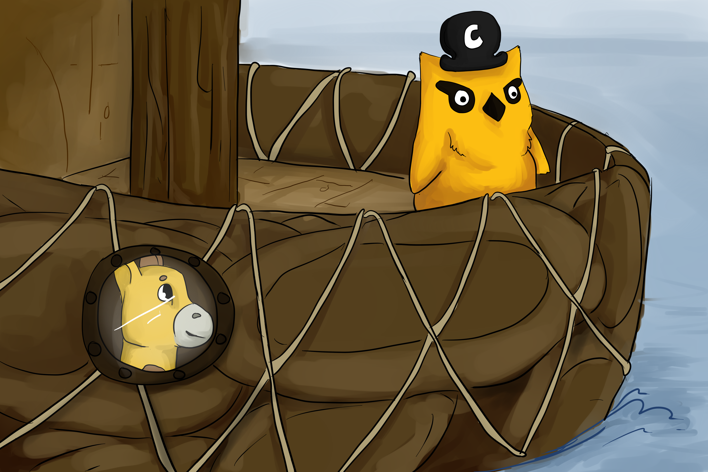
キャプテン・クーベは、船に乗っているポッドに自分のコンテナを乗せてみては？と提案しました。

フィッピーは彼女のコンテナを乗せました。それは、まるでお家にいるかのように居心地よく感じました。

## page15
---
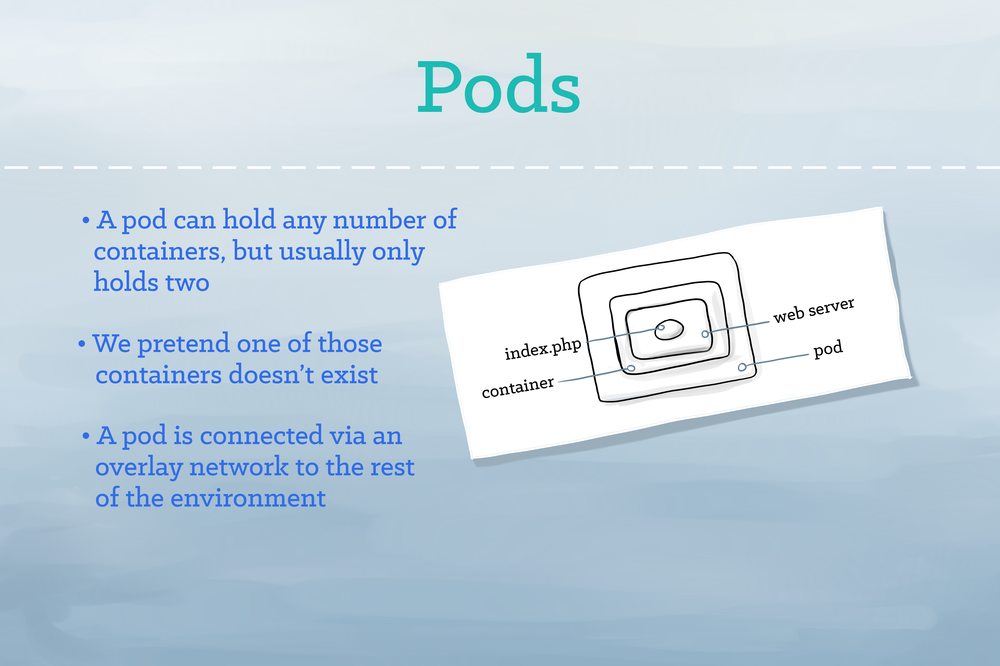
ポッドはKubernetesで実行可能なコンテナをまとめたものです。通常は、単一のコンテナがポッドで実行されます。

しかし、いくつかのコンテナが密接に関連している場合は、同じポッドの内で複数のコンテナを実行できます。Kubernetesは、ポッドがネットワークと通信できるようKubernetesの環境設定を行います。

## page16
---

Phippy had some unusual interests– she was really into genetics and sheep. 

And so she asked the captain, “What if I want to clone myself… On demand… Any number of times?”

“That’s easy,” said the captain as he introduced her to ReplicaSets.

## page17
---
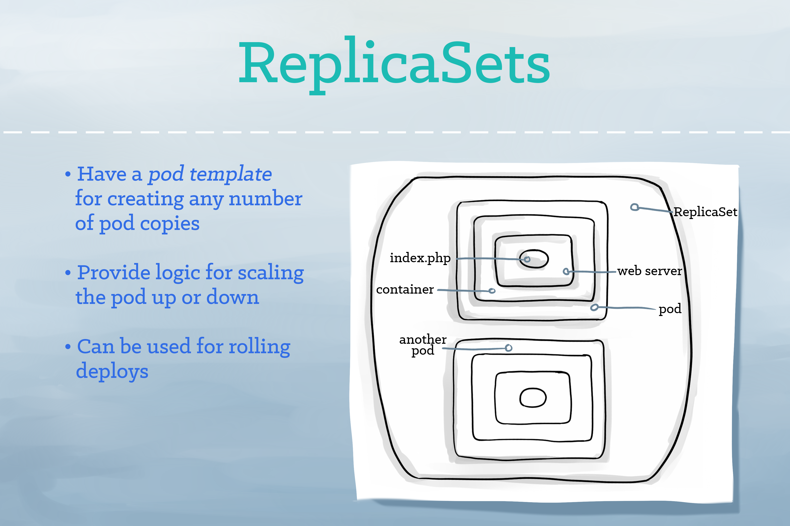
ReplicaSets provide a method for managing an arbitrary number of pods. 

A ReplicaSet contains a pod template, which can be replicated any number of times. 

Through the ReplicaSet, Kubernetes will manage your pods’ lifecycle, including scaling up and down, rolling deployments, and monitoring.

## page18
---

For many days and nights, the little app was happy with her pod and happy with her replicas. But only having yourself for company is not all it’s cracked up to be…even if there are N copies of yourself.

Captain Kube smiled benevolently, “I have just the thing.”

No sooner had he spoken than a tunnel opened between Phippy’s replication controller and the rest of the ship. With a hearty laugh, Captain Kube said, “Even when your clones come and go, this tunnel will stay here so you can discover other pods, and they can discover you!”

## page19
---

A service tells the rest of the Kubernetes environment (including other pods and ReplicaSets) what services your application provides. 

While pods come and go, the service IP addresses and ports remain the same. Other applications can find your service through Kurbernetes service discovery.

## page20
---
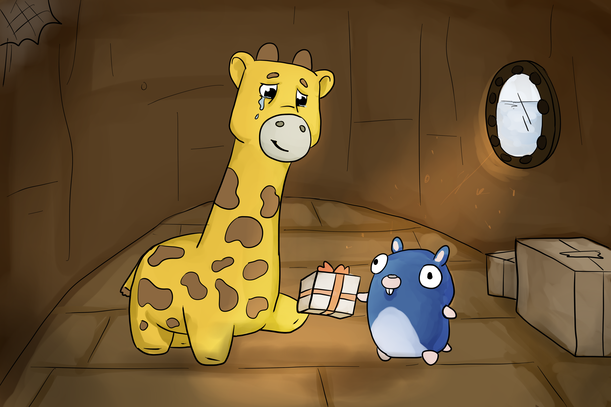
Phippy began to explore the rest of the ship. 

It wasn’t long before Phippy met Goldie and they became the best of friends. One day, Goldie did something extraordinary. 

She gave Phippy a present. Phippy took one look and the saddest of sad tears escaped her eye.

“Why are you so sad?” asked Goldie.

“I love the present, but I have nowhere to put it!” sniffled Phippy.

But Goldie knew what to do, “Why not put it in a volume?”

## page21
---
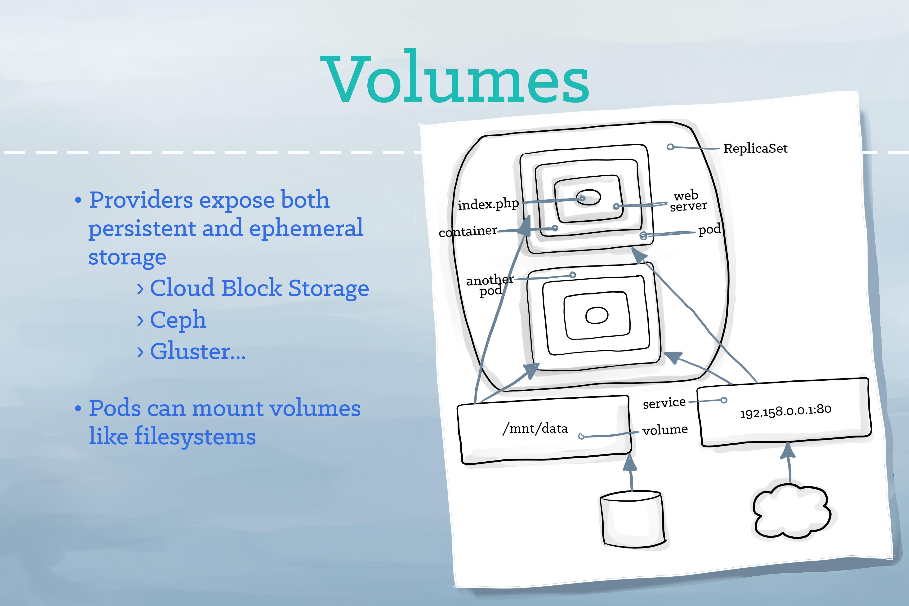
A volume represents a location where containers can access and store information. 

The volume appears as part of the local filesystem. 

Volumes may be backed by local storage, Ceph, Gluster, cloud block storage, or a number of other storage backends.

## page22
---
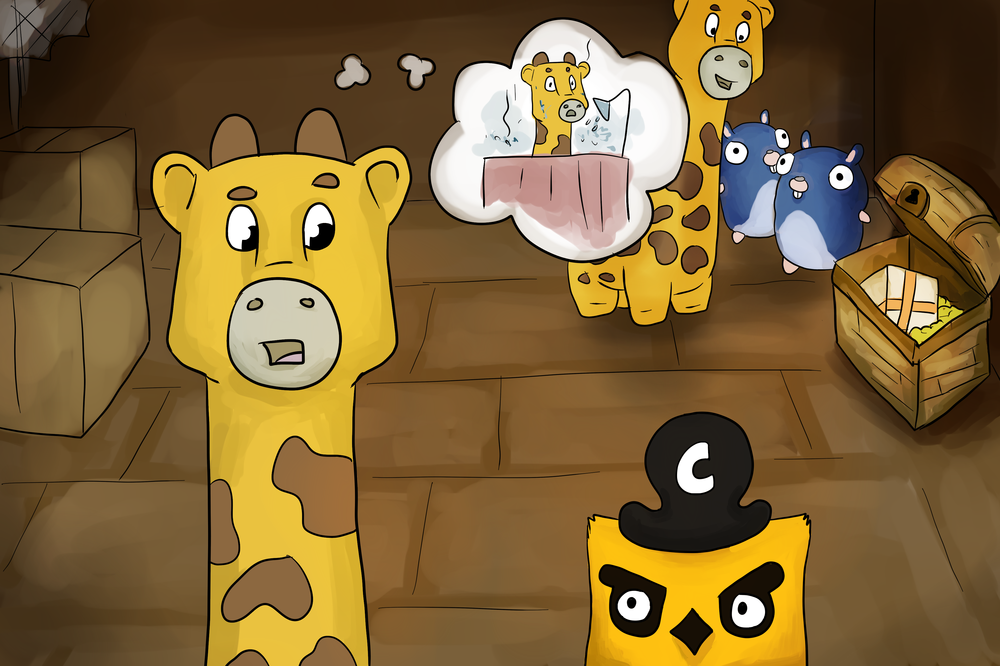
Phippy loved life aboard Captain Kube’s ship and she enjoyed the company of her new friends (every replicated pod of Goldie was equally delightful). 

But as she thought back to her days on the scary hosted provider, she began to wonder if perhaps she could also have a little privacy.

“It sounds like what you need,” said Captain Kube, “is a namespace.”

## page23
---
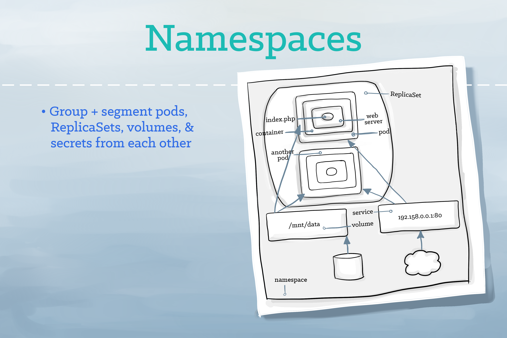
A namespace functions as a grouping mechanism inside of Kubernetes. 

Services, pods, ReplicaSets, and volumes can easily cooperate within a namespace, and the namespace provides a degree of isolation from  other parts of the cluster.

## page24
---
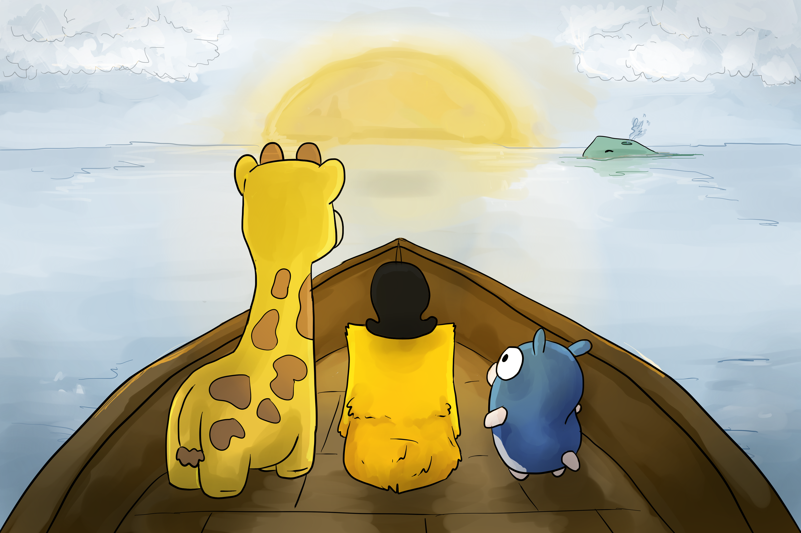
Life was good aboard Captain Kube’s boat. 

Together with her new friends, Phippy sailed the seas. 

She had many grand adventures, but most importantly, Phippy had found her home.

And so Phippy lived happily ever after.  
その後、Phippyは幸せに暮らしましたとさ。

## page25 Blank

## page26 Blank

